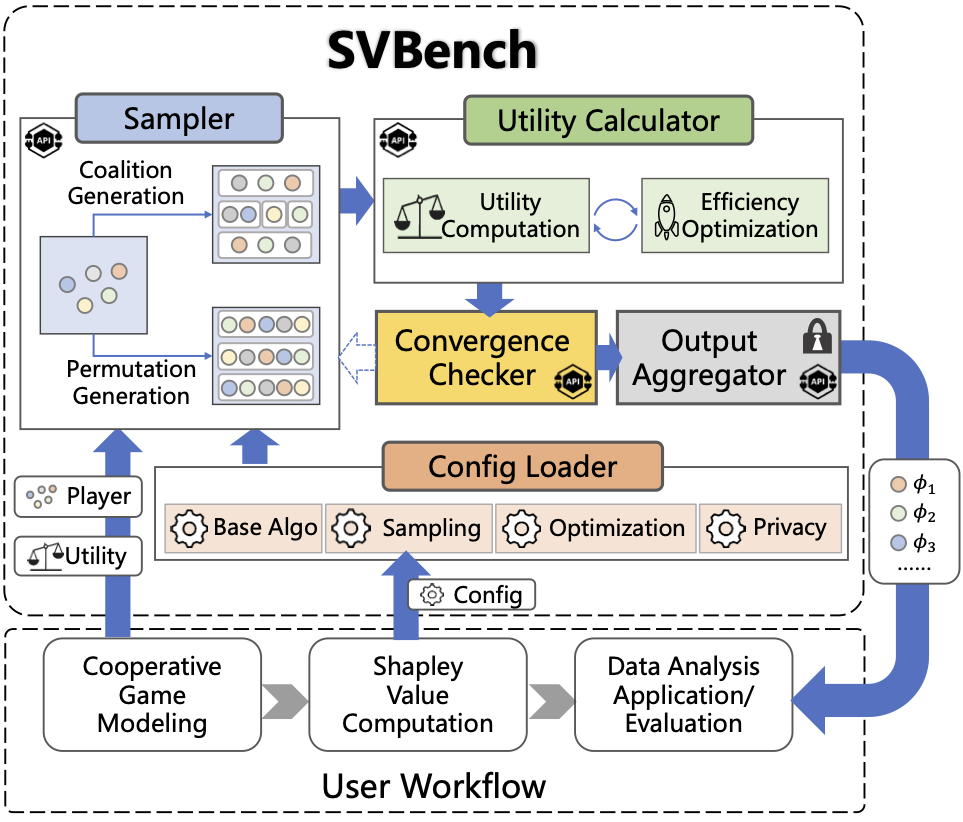

# ***SvBench*** 

***SvBench*** is a free, powerful benchmark providing a series of algorithms for exact computing and approximate computing of Shapley Value (SV) in data analysis (DA). SV is a solution concept from cooperative game theory. A cooperative game is composed of a player set and a utility function that defines the utility of each coalition (i.e., a subset of the player set). SV is designed for fairly allocating the overall utility generated by the collective efforts of all players within a game. This solution concept has already been widely applied in various DA tasks modeled as cooperative games for pricing, selection, weighting, and attrition of data and its derivatives (e.g., ML models well trained in DA tasks).




As shown in the figure, ***SvBench***  is composed of a config loader, a sampler, a utility calculator, a convergence checker, and an output aggregator for computing SV by iterative rounds. A round of SV calculation is conducted starting from the sampler and ending at the convergence checker.  Once the convergence criterion is not met, another round will be initiated as demonstrated in the figure (with dashed arrow). The following two tables summarize the functions of the five modules in  ***SvBench*** and the main parameters used by SV computing algorithms. Using the five modules, ***SvBench*** implements five base SV calculation algorithms (**MC**, **RE**, **MLE**, **GT**, and **CP**) and several hybrid algorithms, each combining one base algorithm with a specific efficiency optimization. For more details of SV computing techniques, please refer to our [survey paper](https://arxiv.org/abs/2412.01460). 

|  Module | Description | Main Implemented Techniques |
| :------: | -------------------- | ------------ |
| **configuration loader** | Load the SV computing parameters specified by the users| / |
| **sampler** | Generate the coalitions or permutations of players based on the configured sampling strategy| Random Sampling, Stratified Sampling, Antithetic Sampling |
| **utility calculator** | Compute the utility of the sampled coalitions or permutations. When users specify an efficiency optimization strategy, the utility calculator will use that strategy to accelerate the computation. | Truncation, ML Speedup for Efficiency Optimization |
| **convergence checker** | Determine whether to terminate the SV computation based on the convergence criterion specified in the configuration | SV Ranking |
| **configuration loader** | Generate the final SV of each player. If users specify privacy protection measures, the aggregator will execute those measures before reporting the final results. | Measures (i.e., Differential Privacy, Quantization and Dimension Reduction) for Privacy Protection on SV. |

|  Config | Parameters  (Default setting is in bold.) |
| :------: | -------------------- |
| **Base Algo** | **`MC`**, `RE`, `MLE`, `GT`, `CP`, `user-specific` |
| **Sampling** | `None`,**`random`**, `antithetic`, `stratified`, `user-specific` |
| **Optimization** | **`None`**, `TC`, `GA`, `TC+GA`, `GA+TSS`, `TC+GA+TSS`, `user-specific` |
| **Privacy** | **`None`**, `DP`, `QT`, `DR`, `user-specific` |


[](https://github.com/apecloud/foxlake/blob/main/LICENSE) [](https://github.com/DDDDDstar/SV4DA/actions/workflows/codeql.yml) [](https://github.com/DDDDDstar/SV4DA/graphs/contributors) [](https://www.python.org/)

## Get Started

### Code Preparation

To use ***SvBench***, you need first to download all the codes to your project directory, which is supposed to be looked like this:

```
.
├── Tasks
│   ├── Nets.py
│   ├── data_preparation.py
│   ├── data_valuation.py
│   ├── federated_learning.py
│   └── result_interpretation.py
├── calculator.py
├── config.py
├── output.py
├── privacy_utils.py
├── run.py
└── sampler.py
```
### Downloading dependencies

```
pip3 install -r requirements.txt  
```

## DA Task Preparation and Cooperative Game Modeling

Before using ***SvBench***  to implement a specific SV computing algorithm, users need to properly prepare their targeted DA task, specifying the player and utility function in the task for modeling the task as a cooperative game. Guidelines for cooperative game modelling can be found in our [survey paper](https://arxiv.org/abs/2412.01460). 
In this repository, we show three typical DA tasks, namely **Result Interpretation(RI)**, **Data Valuation(DV)**, and **Federated Learning(FL)**, as example use cases. The datasets used by each task (which are generated by `Task/data_preparation.py`) and the cooperative game modelling for each task are summarized in the following tables:

|  Dataset | # Training Data Tuples | # Test Data Tuples | # Features for Each Tuple | # Classes |
| :----: | --------- | --------- | --------- | --------- |
| **Iris** | 120  | 30 | 4 | 3|
| **Wine** | 142 | 36| 13 |3|
| **MNIST** | 60,000   | 10,000  | 1 x 28 x 28 |10|
| **Cifar-10** |  50,000  | 10,000   |  3 x 32 x 32 |10|

|  Task  | Dataset  | Player (Number of Players)  | Utility  | Model  |
| :----: | -------------------- | ------------ | ------------- | ------------------- |
| **RI** | *Iris*    | data feature （n=4）  | Model Output  | *Multilayer Perceptron* |
| **RI** | *Wine*      | data feature （n=13） | Model Output  | *Multilayer Perceptron* |
| **DV** | *Iris*    | data tuple  （n=120） | Test Accuracy | *Multilayer Perceptron* |
| **DV** | *Wine*      | data tuple （n=142）  | Test Accuracy | *Multilayer Perceptron* |
| **FL** | *MNIST*  | ML model （n=10）| Test Accuracy | *Convolutional Neural Network*|
| **FL** | *Cifar-10* | ML model （n=10）  | Test Accuracy | *Convolutional Neural Network*|

- The RI task on Iris uses SV to explain how the four biological features influence the results of classifying three types of iris plants.
- The RI task on Wine explains how 13 chemical constituents influence the results of classifying three types of wine.
- The DV tasks on Iris and Wine use SV to evaluate the importance of 120 iris plants and 142 wine samples to improve the classification accuracy. 
- The FL tasks on MNIST and Cifar-10 distribute the two datasets to 10 devices, using SV to valuate the local models trained by those devices for the higher accuracy in handwritten digits classification and object recognition.

<!-- After this, to run the three benchmark tasks, you could just run the `run.py` directly with relevant parameters.-->

<!-- For example, run the DV task with *Iris* dataset, *regression* model, and **MC** algorithm to calculate SVs:-->

<!-- ```sh-->
<!-- python -u run.py --task=DV --dataset=iris --algo=MC --ep=30 --bs=16 --lr=0.01-->
<!-- ```-->

<!-- In addition to running benchmark tasks, SvBench also supports users to implement their own DA tasks by parameter settings and remaking the **Sampler** and **Calculator** modules.-->

<!-- The specific parameter settings are explained as follows.-->

## SV Computation

Given a well-prepared DA task, users then needs to specify the following parameters used by ***SvBench***  for implement their specific SV computing algorithm in the prepared task:

<!-- ### Parameters for benchmark tasks-->
<!-- To run the benchmark tasks of ***SvBench***, there are the following parameters: -->

|    Parameter    |         Scope          | Description                                                 | Default | Applicable Algorithms |
| :-------------: | :-------------------------------: | ------------------------------------------------------------ | :-----: | --------------- |
|   task   |                 `RI` `DV` `FL`                  | The name of the DA task. |    -    | - |
| dataset |  `iris` `wine` `mnist` `cifar` | The dataset used by DA tasks. |    -    | - |
|             ep             |  positive integers | The number of epoches for training a model on a specific dataset.           |    30    | - |
|             bs             |  positive integers  | The batch sized used in model training .                |    16    | - |
| lr | positive decimals  | The learning rate used in model training. | 0.01 | - |
|     base_algo     | {`MC` `RE` `MLE` `GT` `CP`} | The base SV computing algorithms implemented based on the classical SV formulation (`MC`), regression-based SV formulation (`RE`), multilinear-extension-based SV formulation (`MLE`), group-testing-based SV formulation (`GT`) and compressive-permutation-based SV formulation(`CP`). |  `MC`   | - |
| GT_epsilon | positive decimals | The epsilon used in GT algorithm. | 0.00001 | `GT` |
| CP_epsilon | positive decimals | The epsilon used in CP algorithm. | 0.00001 | `CP` |
| num_measurement | positive integers | The number of measurements used by CP algorithm. | 10 | `CP` |
|   convergence_threshold    |  0~1  | Threshold for determining the convergence and termination of SV computing algorithm |   0.1    | - |
| sampling_strategy | `random` `antithetic` `stratified` | The strategy for sampling coalitions or permutations. | `random` | - |
| optimization_strategy | `None`, `TC`, `GA`, `TC+GA`, `GA+TSS`, `TC+GA+TSS` | Truncation and ML speedup (GA, TSS) techniques for accelerating utility calculation. | `None` | - |
| truncation_threshold | - | Threshold used by truncation technique. | 0.01 | - |
| privacy_protection_measure | `DP` `QT` `DR` | Differential privacy(`DP`), quantization(`QT`) and dimension reduction(`DR`) for privacy protection on SV. | `None` | - |
| privacy_protection_level | 0 ~ 1 | The parameter determining the magnitude of privacy protection, 1 for the strongest protection, 0 for no privacy protection. | 0.0 | - |
| num_parallel_threads | - | The number of threads used for parallel computing. | 1 | - |

Here, we provide the instructions for running several representative SV computing algorithms in the aforementioned six example DA tasks.
(1) run **MC** algorithm in six DA tasks.
```sh
python -u run.py --task=DV --dataset=iris --algo=MC --ep=30 --bs=16 --lr=0.01
```
```sh
python -u run.py --task=DV --dataset=wine --algo=MC --ep=100 --bs=xxx --lr=xxx
```

## Parameters for User-specific

|    Parameter     | Type | Examples              | Note                                                         |
| :--------------: | :--: | --------------------- | ------------------------------------------------------------ |
|       task       | str  | "feature_attribution" | There must be a `{task}.py` under the `Tasks/` directory.    |
| utility_function | str  | "{task}.utility_calc" | There must be a `{task}.utility_calc` function in `{task}.py`. |
|       algo       | str  | "newSV"               |                                                              |
|                  |      |                       |                                                              |
|                  |      |                       |                                                              |
|                  |      |                       |                                                              |
|                  |      |                       |                                                              |
|                  |      |                       |                                                              |
|                  |      |                       |                                                              |

